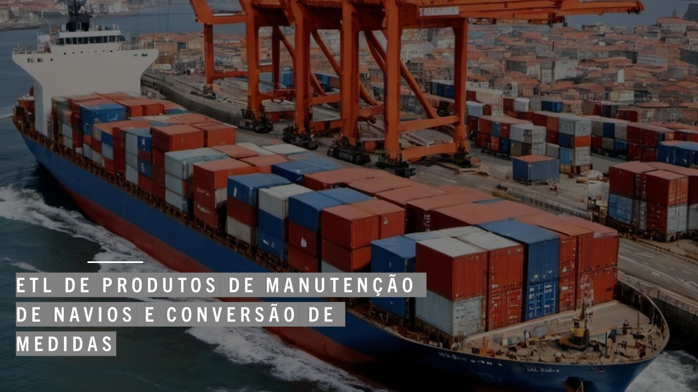
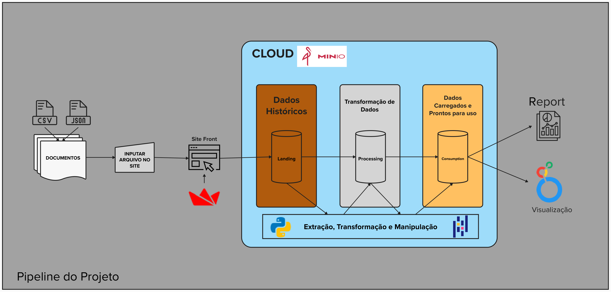

## Objetivos do Projeto

#### Recebemos diariamente arquivos contendo produtos para manutanção maritma, o problema é que estes arquivos são enviados em formatos diferentes em JSON ou CSV, além disso o formato das medidas dos produtos está em metricas imperiais, e trabalhamos com o Sistema Métrico Internacional, para isso é preciso realizar essa conversão, além de alocar esses produtos em um unico arquivo e deixa-lo disponivel para uso futuro. 

## Desafios do Projeto

#### O projeto tem o desafio de criar uma estrutura de dados para recebimento de arquivos em formato csv e json, le-los, realizar as transformações necessarias, armazena-los, concatena-los e disponibiliza-los novamente para o cliente.

#### -> Desenvolvimento do front-end para cliente inputar arquivos.
#### -> A criação de uma estrutura de arqmazenamento que se conectasse ao front-end e pudesse ser requisitada nos processos de transformação dos arquivos.
#### -> Criação das camadas no banco para armazenamento de dados historicos, dados transformados e dados para utilização
#### -> Manter a escrita do codigo de forma limpa, utilizando funções para reaproveitamento.
#### -> Manter uma documentação eficiente do codigo para futuras manutenções e colaboradores.
#### -> Realizar as operações de transformação dos dados de forma eficiente e que evite erros.

## Arquitetura

## Tecnologias Empregadas 

### Front-end:
####    Streamlit - O Streamlit é uma biblioteca em Python que permite criar interfaces web para análise de dados e machine learning com facilidade, usando apenas scripts simples.
####    OS - O módulo os em Python fornece funcionalidades para interagir com o sistema operacional, como manipulação de arquivos, diretórios e variáveis de ambiente.

### Armazenamento de dados:
####    miniO - O miniO é um sistema de armazenamento de objetos de código aberto, leve e altamente escalável, projetado para funcionar eficientemente em ambientes distribuídos, sendo uma alternativa ao Amazon S3.

### Pipeline de dados:
####    Pandas - Foram desenvolvidos dois scripts independentes para tratar dados vindos de arquivos JSON ou CSV, cada um com suas particularidades

#### Testes: Ainda não foi empregado um framework para testes, uma vez que o projeto está passando por replanejamento, provavelmente irei empregar pytest. 

### Documentação: 
####    MKdocs - O MkDocs é uma ferramenta de código aberto escrita em Python que permite a criação rápida e fácil de documentação estática a partir de arquivos Markdown. É popular para criar documentação de projetos, websites e manuais de software.

## Proximas Etapas:
####    O projeto no inicio realizava localmente o recebimento de arquivos, onde o ETL era efetuado e as transformações eram realizadas e a saida era um novo arquivo com os dados concatenados e tratados. Pensando em disponibilidade resolvi refatorar o projeto e desevolver um front-end para envio dos arquivos, criação de uma estrutura mais moderna de armazenamento para dados historicos, dados tratados e dados utilizaves. Com isso finalizei a criaçao do front-end e a integração com o data-lake, ja criei as camadas, falta a conexão do ETL com o data-lake para puxar os dados da camada landing, efetuar as transformações salvar na camada processing e a concatenação na camada consumption.